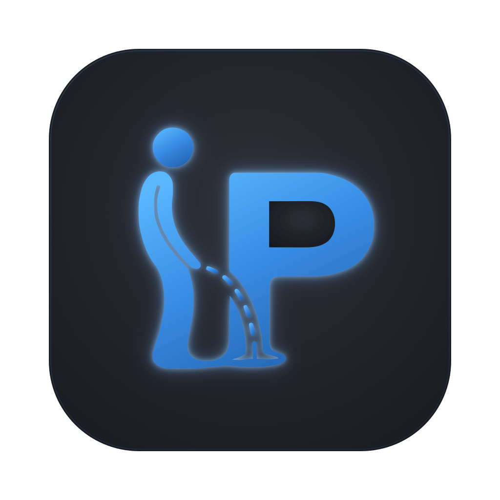

<p align="center">
  
</p>

<h1 align="center">It Hurts When IP</h1>

<p align="center"><em>A desktop tool for switching between manual or saved network IP configurations — quickly, and without re-entering your password every single time.</em></p>

<p align="center">Yes, the name is a pun. No, we're not going to explain it.</p>

<p align="center">
  
</p>

<p align="center">
  <video src="https://github.com/user-attachments/assets/ca3545e8-a5a8-4a20-b3d2-fac7508b235d" controls width="600"></video>
</p>

## What it does

If your work involves regularly moving a machine between networks — swapping between a static lab address, a client subnet, and DHCP, for example — you know the routine: open Network settings, retype the same IP details, confirm, authenticate. Every single time.

**It Hurts When IP** keeps your network configurations saved and lets you switch between them in one click. The actual network changes are applied by a small privileged helper that runs in the background, so you authenticate **once** at install time and never get a prompt for routine switches afterward.

It runs on both **macOS** and **Windows** from this single repository. macOS is the original, more mature platform; Windows support was added more recently.

## Install

### macOS

1. Go to the [latest Release](https://github.com/jaylenjupp/it-hurts-when-ip/releases/latest).
2. Download the `.pkg` installer.
3. Double-click it and follow the prompts. You'll be asked for your password **once** — this lets the installer set up the privileged helper daemon that performs network changes.
4. That's it. The app is installed to `/Applications` and the helper is configured automatically.

### Windows

1. Go to the [latest Release](https://github.com/jaylenjupp/it-hurts-when-ip/releases/latest).
2. Download the `.exe` installer.
3. Run it and follow the prompts. Approve the **User Account Control (UAC)** prompt when it appears — this lets the installer set up the privileged helper that performs network changes.
4. Once installed, launch It Hurts When IP from the Start menu.

## ⚠️ First launch: the security warning

The app is **not yet signed/notarized**, so the first time you open it, your OS will warn that it can't verify the developer. **This is expected for unsigned apps and is safe.** You only need to do the workaround once.

### macOS (Gatekeeper)

macOS will refuse to launch with a message like *"It Hurts When IP can't be opened because Apple cannot check it for malicious software"* or *"unidentified developer."*

**Option A — Right-click to open (easiest)**

1. Open `/Applications` in Finder.
2. **Right-click** (or Control-click) **It Hurts When IP.app** → **Open**.
3. Click **Open** again in the dialog that appears.

After this, the app launches normally like any other.

**Option B — Clear the quarantine flag in Terminal**

```bash
xattr -cr "/Applications/It Hurts When IP.app"
```

Then open the app normally.


### Windows (SmartScreen)

Windows may show a blue **"Windows protected your PC"** dialog from Microsoft Defender SmartScreen.

1. Click **More info**.
2. Click **Run anyway**.

The app then launches normally on subsequent runs.

## Usage

The app is built around your saved configurations:

- **Quick-set buttons** — save your common network configs and apply any of them with a single click.
- **DHCP** — switch the interface back to automatic (DHCP) addressing when you're done.
- **Manual entry** — enter a one-off IP configuration by hand when you need something that isn't saved.

Because the privileged helper applies the changes, none of these actions prompt you for a password.

## Uninstall

### macOS

The uninstaller is bundled inside the app:

1. In `/Applications`, **right-click It Hurts When IP.app** → **Show Package Contents**.
2. Navigate to **Contents → Resources**.
3. Double-click **`uninstall.command`**.

This removes It Hurts When IP and its privileged helper from your system.

### Windows

Uninstall from **Settings → Apps → Installed apps → It Hurts When IP → Uninstall**. The uninstaller automatically stops and removes the privileged background service and deletes the app's files.

## Building from source

This is a standard Tauri 2 project. You'll need [Rust](https://rustup.rs/), [Node.js](https://nodejs.org/), and the Tauri 2 prerequisites for your platform.

```bash
npm install
```

### macOS

Produces the distributable `.pkg`:

1. Build the privileged helper in `helper-tool/` as a universal (Apple Silicon + Intel) binary.
2. Build the universal app bundle:
   ```bash
   npm run tauri build -- --target universal-apple-darwin
   ```
3. Assemble the `.pkg` installer:
   ```bash
   bash build-pkg.sh
   ```

The macOS bundle identifier is `com.ithurtswhenip.desktop`.

### Windows

The distributable is a single `.exe` built with [Inno Setup 6](https://jrsoftware.org/isinfo.php) — this installer is what registers and starts the privileged service. (Tauri's bundler also auto-produces an `.msi` and an NSIS `_x64-setup.exe`; these are **not** used for distribution.)

1. Build the app:
   ```powershell
   npm run tauri build
   ```
2. Build the privileged service in **release** mode — the installer script consumes the release binary:
   ```powershell
   cd service-tool
   cargo build --release
   cd ..
   ```
3. Compile the installer with Inno Setup:
   ```powershell
   & "$env:LOCALAPPDATA\Programs\Inno Setup 6\ISCC.exe" "installer-iss\installer.iss"
   ```
   (If Inno Setup was installed system-wide rather than per-user, `ISCC.exe` is instead under `C:\Program Files (x86)\Inno Setup 6\`.)

The installer is written to `installer-build\ItHurtsWhenIP-Setup-<version>.exe`.

## License

It Hurts When IP is released under the **GNU General Public License v3.0 (GPL-3.0)**. See the [LICENSE](LICENSE) file for the full text.

---

**It Hurts When IP** · v1.13.1 · GPL-3.0 · provided as-is, without warranty.